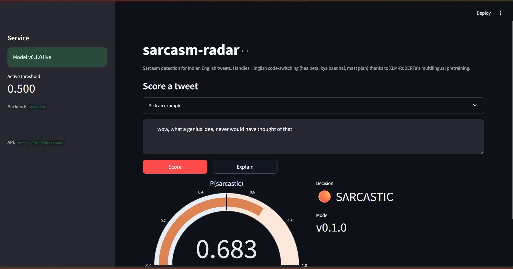

<div align="center">

# 🎯 sarcasm-radar

**Sarcasm detection for Indian English & Hinglish tweets**

An end-to-end NLP project — data curation, a TF-IDF baseline, transformer
fine-tuning (DistilBERT, XLM-RoBERTa), a FastAPI inference service with
LIME explanations, and a Streamlit demo. Tested, typed, and containerized.

[](https://www.python.org/)
[](https://pytorch.org/)
[](https://huggingface.co/docs/transformers)
[](https://fastapi.tiangolo.com/)
[](Dockerfile)
[](LICENSE)
[](https://github.com/astral-sh/ruff)

<br/>



</div>

---

## 🧰 Tech stack

| Area | Tools & techniques |
|---|---|
| **Language** | Python 3.12 |
| **NLP / Deep Learning** | PyTorch · HuggingFace Transformers · DistilBERT · XLM-RoBERTa · transformer fine-tuning · tokenization |
| **Classical ML** | scikit-learn · TF-IDF · Logistic Regression · n-grams |
| **Explainability** | LIME — per-token attribution |
| **Data** | pandas · HuggingFace `datasets` · custom annotation & curation pipeline |
| **Evaluation** | macro-F1 · per-class precision/recall · stratified split · cross-domain probe |
| **Serving** | FastAPI · Uvicorn · REST API · Streamlit · Plotly |
| **Infrastructure** | Docker · docker-compose |
| **Code quality** | pytest (160+ tests) · mypy `--strict` · ruff · pre-commit |

---

## ❓ What it does

The interesting question isn't whether a transformer beats logistic
regression at sarcasm — it does. It's whether an English-only DistilBERT
fine-tune handles **Hinglish** — phrases like *"haa beta, very smart
move"* or *"mast plan, ab toh sab kuch theek ho hi jayega"* — and whether
an explicit multilingual model (XLM-RoBERTa) actually helps.

It's a full machine-learning lifecycle on one focused NLP problem:
**data collection → curation → EDA → preprocessing → model training →
evaluation → deployment.**

---

## 📦 Highlights

**Data engineering**
- HuggingFace loaders for the iSarcasm and SemEval-2022 Task 6 corpora
- normalization into a single `(text, label, source, language_register)`
  schema with first-frame-wins deduplication
- a **50-row hand-curated Indian English supplement** with a written
  labelling protocol — the distinctive piece of the project
- tweet-aware text cleaning (URLs, @mentions, hashtags, repeated chars),
  Hinglish-friendly: no lowercasing, no emoji removal, no stopword removal

**Modeling**
- TF-IDF + Logistic Regression baseline
- DistilBERT fine-tuned via the HuggingFace `Trainer` API
- XLM-RoBERTa fine-tune + a per-register macro-F1 comparison helper

**Production**
- FastAPI service — `/health`, `/predict`, `/explain`
- LIME per-token explanations on the `/explain` endpoint
- Streamlit demo — Plotly score gauge + token-weight visualization
- multi-stage Dockerfile + docker-compose for the full stack

**Engineering rigor**
- 160+ tests, `mypy --strict` clean, ruff lint + format clean
- pre-commit hooks for lint, format, and type checks

---

## 📊 Results

Trained on the **SemEval-2022 Task 6 iSarcasmEval** English set (2,773
train / 694 test tweets, stratified 80/20). The 50-row curated Indian
English set is held out entirely as a **cross-domain probe** — no model
trains on it. Reproduce on a free Colab GPU with
[`notebooks/03_train_colab.ipynb`](notebooks/03_train_colab.ipynb).

| Model | Macro-F1 (iSarcasmEval test) | Macro-F1 (Indian English probe, n=50) |
|-------|:-:|:-:|
| TF-IDF + Logistic Regression | 0.545 | 0.523 |
| **DistilBERT** ⭐ | **0.588** | **0.696** |
| XLM-RoBERTa | 0.428 † | 0.333 † |

⭐ **DistilBERT is the production model.** 0.588 macro-F1 sounds modest,
but iSarcasmEval is a deliberately hard benchmark — the SemEval-2022
Task 6 shared-task systems scored in the **0.57–0.61** range, so this is
competitive with the published competition results. DistilBERT also
holds up on the curated Indian English probe (0.696), so a model trained
only on Western tweets generalizes reasonably to the en-IN / hi-en
register.

† **XLM-RoBERTa-base collapsed to the majority class** — per-class F1 on
the test set was 0.857 (not-sarcastic) and **0.000 (sarcastic)**. It
learned the trivial all-negative solution and never predicts the
minority class. This is a known instability of XLM-R-base on small
(~2.7k rows), class-imbalanced data without a class-weighted loss —
reported here as an honest negative result, with the diagnosis and fix
written up in [`docs/model_card.md`](docs/model_card.md).

---

## 🏗 Architecture

```
   iSarcasm + SemEval                  data/curated/indian_english.csv
   (HuggingFace, gitignored)           (50 hand-labelled rows, committed)
          │                                       │
          └───────────────┬───────────────────────┘
                          ▼
                data.load.merge_corpora
               (text, label, source, language_register)
                          │
                          ▼
                     data.clean
                          │
         ┌────────────────┼────────────────┐
         ▼                ▼                ▼
    TF-IDF + LR      DistilBERT       XLM-RoBERTa
                          │
                          ▼
                  models.inference  ──►  FastAPI  ──►  Streamlit demo
                                         /predict /explain (LIME)
```

Full component walkthrough in [`docs/architecture.md`](docs/architecture.md).

---

## 🚀 Quickstart

```bash
make install-dev      # editable install + dev tools
make data             # download iSarcasm + SemEval corpora
make train            # fine-tune DistilBERT
make serve            # FastAPI  → http://localhost:8000
make app              # Streamlit → http://localhost:8501
```

Or `docker compose up` to bring up the API + demo together.

---

## 🔌 API

```bash
curl -sX POST http://localhost:8000/predict \
  -H 'content-type: application/json' \
  -d '{"text":"mast plan, ab toh sab kuch theek ho hi jayega"}'
```

```json
{
  "text": "mast plan, ab toh sab kuch theek ho hi jayega",
  "probability": 0.88,
  "decision": "SARCASTIC",
  "threshold": 0.5,
  "model_version": "v0.1.0"
}
```

`/explain` returns the same fields plus a `tokens` array of LIME
per-token weights — positive pushes toward sarcastic, negative toward not.

---

## 🏷 Growing the curated dataset

```python
from sarcasm_radar.data.curate import append_label

append_label(
    text="kya mast plan banaya hai bhai, sab ka time waste",
    label=1,
    register="hi-en",
    rationale="praising a plan that wastes everyone's time",
)
```

The helper validates each row (rejects empty text, empty rationale, or
bad label/register) and appends to `data/curated/indian_english.csv`.
The rationale field is enforced non-empty — it's the quality-control
mechanism that lets a second annotator audit the set.

---

## 📂 Project layout

```
src/sarcasm_radar/
  data/         loaders, schema normalization, cleaning, curation pipeline
  features/     tokenization helpers
  models/       baseline (TF-IDF+LR), transformer, multilingual, inference
  evaluation/   macro-F1 + per-class metrics
  api/          FastAPI app (/health, /predict, /explain)
  utils/        structured logging

data/curated/   the 50-row Indian English supplement + labelling protocol
notebooks/      01 EDA · 02 error analysis · 03 Colab training
app/            Streamlit demo
tests/          160+ tests, mypy strict
docs/           model card · data card · architecture
```

---

## 📚 Dataset citations

> Silviu Oprea and Walid Magdy. *iSarcasm: A Dataset of Intended
> Sarcasm.* ACL 2020.

> Ibrahim Abu Farha, Silviu Vlad Oprea, Steven Wilson, Walid Magdy.
> *SemEval-2022 Task 6: iSarcasmEval — Intended Sarcasm Detection in
> English and Arabic.* SemEval 2022.

## 📄 License

MIT — see [LICENSE](LICENSE).
